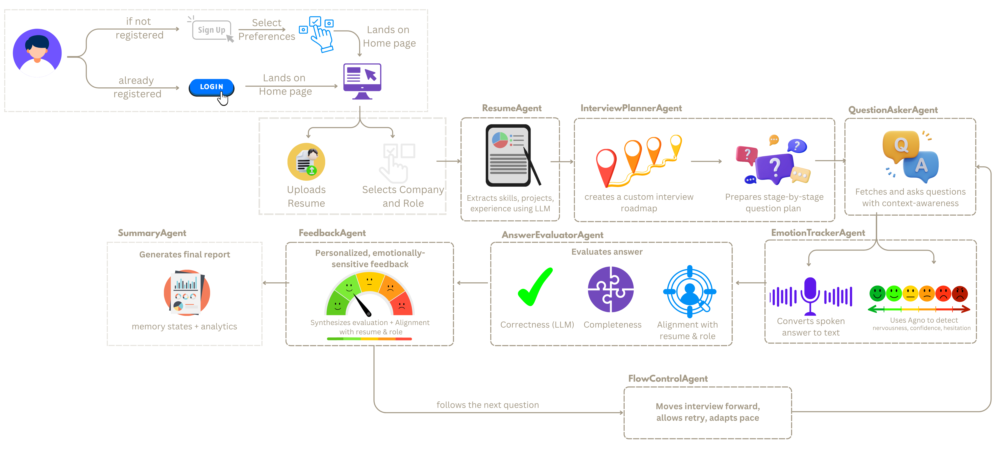

<p align="center">
  
</p>

## About

Placementor is an advanced interview preparation platform designed to assist users in practicing and refining their interview skills. Developed during a hackathon, this project utilizes sophisticated AI agents to simulate realistic interview scenarios and provide actionable feedback.

## Flow:
<p align="center">
  
</p>

## Demo: [Youtube Video](https://youtu.be/RogdnodHS_4)

## Table of Contents

- [Features](#features)
- [Tech Stack](#tech-stack)
- [Agents](#agents)
  - [Feedback Agent](#feedback-agent)
  - [Question Fetcher](#question-fetcher)
  - [Interview Planner](#interview-planner)
  - [Resume Parser](#resume-parser)
- [Installation](#installation)
- [Usage](#usage)
- [Screenshots](#screenshots)
- [Contributing](#contributing)
- [Developed By](#developed-by)

## Features

- **Resume Upload and Parsing**: Users upload their resumes, which are parsed to extract relevant information.
- **Interview Simulation**: Users select a company, role, and interview round to generate a tailored set of interview questions.
- **Speech Recognition**: Users practice answering questions using voice input.
- **Feedback and Evaluation**: AI agents evaluate user responses and provide detailed feedback, including scores and improvement suggestions.

## Tech Stack

- **Frontend**: React.js, Tailwind CSS, Axios
- **Backend**: Python, Flask
- **AI and NLP**: Agno Framework, Gemini, SpeechRecognition
- **Data Handling**: JSON
- **Version Control**: Git

## Agents
### Resume Parser

- **Purpose**: Extracts structured information from a user's uploaded resume.
- **Logic**:
  - Uses the Gemini model within the Agno framework to parse the resume and extract key details such as full name, email, phone, skills, projects, education, and work experience.
  - Constructs a prompt that instructs the AI to return the extracted information in a structured JSON format.
  - Processes the AI response to extract and return the relevant information in the specified format.
 
### Interview Planner

- **Purpose**: Generates a structured interview plan based on the user's resume, target company, role, and interview round.
- **Logic**:
  - Uses the Gemini model within the Agno framework to create a list of interview questions tailored to the user's selected parameters.
  - Constructs a detailed prompt that guides the AI to generate questions simulating a real interview, starting with introductory questions and gradually increasing in difficulty.
  - Outputs the interview plan in a structured JSON format, ensuring easy integration with other components.

### Question Fetcher

- **Purpose**: Retrieves specific questions from an interview plan based on the serial number.
- **Logic**:
  - Takes an interview plan and a serial number as inputs.
  - Converts the serial number to a string to match the format in the JSON data.
  - Iterates through the interview plan to find and return the question corresponding to the given serial number.
  - Returns an error if the question is not found, ensuring robustness in handling missing data.


### Feedback Agent

- **Purpose**: Evaluates user responses to interview questions and provides constructive feedback.
- **Logic**:
  - Utilizes the Gemini model within the Agno framework to analyze user answers based on structure, clarity, relevance, and impact.
  - Constructs a prompt that instructs the AI to evaluate answers on a scale of 1 to 10, provide feedback, suggest improvements, and decide if the user should repeat the question.
  - Processes the AI response to extract and return a structured JSON format containing the score, feedback, corrected answer, and repeat status.

## Installation

1. Clone the repository:
   ```bash
   git clone https://github.com/tejasgadge2504/PlaceMentor
   ```

2. Navigate to the project directory:
   ```bash
   cd Placementor
   ```

3. Install the required dependencies:
   ```bash
   pip install -r requirements.txt
   ```

## Usage

1. **Upload Resume**: Upload your resume in PDF format. The system will parse the resume and extract relevant information.

2. **Select Interview Parameters**: Choose the target company, role, and interview round to generate a tailored set of interview questions.

3. **Practice Interview**: Use the speech recognition feature to practice answering the generated interview questions.

4. **Receive Feedback**: After submitting your answers, the AI agents will evaluate your responses and provide detailed feedback, including scores and suggestions for improvement.

## Screenshots

<table>
  <tr>
    <td align="center">
      
    </td>
    <td align="center">
      
    </td>
  </tr>
  <tr>
    <td align="center">
      
    </td>
    <td align="center">
      
    </td>
  </tr>
</table>


## Contributing

We welcome contributions to Placementor! If you have any ideas, suggestions, or bug reports, please open an issue or submit a pull request.

## Developed By

- [Tejas Gadge](https://github.com/tejasgadge2504)
- [Anisha Shankar](https://github.com/hahaanisha)
